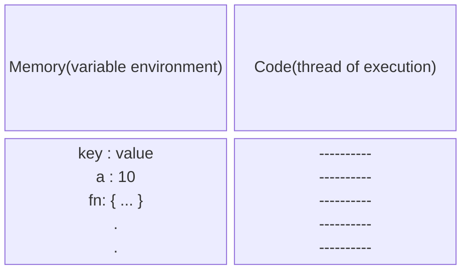

 # What is JavaScript?

**Javascript is a synchronous single threaded language**

JavaScript is a powerful programming language that can add interactivity to a website. It was invented by Brendan Eich.

JavaScript is versatile and beginner-friendly. With more experience, you'll be able to create games, animated 2D and 3D graphics, comprehensive database-driven apps, and much more!

JavaScript itself is relatively compact, yet very flexible. Developers have written a variety of tools on top of the core JavaScript language, unlocking a vast amount of functionality with minimum effort. These include:

- Browser Application Programming Interfaces (APIs) built into web browsers, providing functionality such as dynamically creating HTML and setting CSS styles; collecting and manipulating a video stream from a user's webcam, or generating 3D graphics and audio samples.
- Third-party APIs that allow developers to incorporate functionality in sites from other content providers, such as Disqus or Facebook.
- Third-party frameworks and libraries that you can apply to HTML to accelerate the work of building sites and applications.

# Execution Context

**Everything in JavaScript happens inside an "Execution Context"**



## How JavaScript code is executed?

- A `Global execution context` is created by js engine when we run a code. This execution context is created in two phases:
    1. Memory creation phase
    2. Code execution phase
- In **memory creation phase** js engine scans the code and places all variables encountered with a special value `undefined` and for functions with their definitions.
- In **code execution phase** js engine executes code line by line. As soon it enconters any function, it creates a new execution context and starts the same execution process again.
- After the executon of code the current execution context is destroyed.

## Call Stack

**Call stack maintains the order of execution of execution contexts**

When a javascript program is run, call stack is populated with a global execution context. All the function invocations, their execution context is pushed onto the call stack. When a function return or finishes execution then the execution context is popped out of the call stack.

# Hoisting

Access a variable without initializing it.

```js
console.log(x); // undefined
var x = 10;
console.log(x); // 10
console.log(y); // ReferenceError : y is not defined
```

# Window Object

Global object created by js engine. In global space `this` refers to `window`.