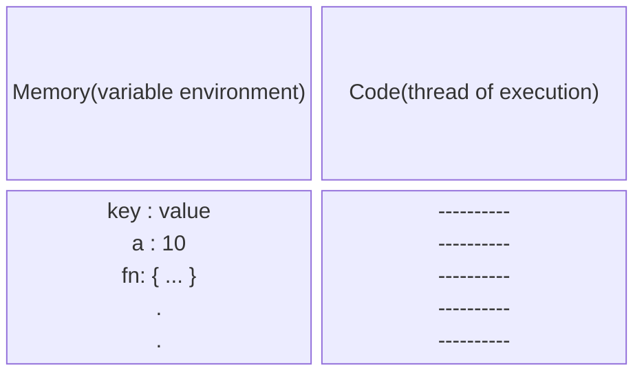

 # What is JavaScript?

JavaScript is a powerful programming language that can add interactivity to a website. It was invented by Brendan Eich.

JavaScript is versatile and beginner-friendly. With more experience, you'll be able to create games, animated 2D and 3D graphics, comprehensive database-driven apps, and much more!

JavaScript itself is relatively compact, yet very flexible. Developers have written a variety of tools on top of the core JavaScript language, unlocking a vast amount of functionality with minimum effort. These include:

- Browser Application Programming Interfaces (APIs) built into web browsers, providing functionality such as dynamically creating HTML and setting CSS styles; collecting and manipulating a video stream from a user's webcam, or generating 3D graphics and audio samples.
- Third-party APIs that allow developers to incorporate functionality in sites from other content providers, such as Disqus or Facebook.
- Third-party frameworks and libraries that you can apply to HTML to accelerate the work of building sites and applications.

# Execution Context

**Everything in JavaScript happens inside an "Execution Context"**

