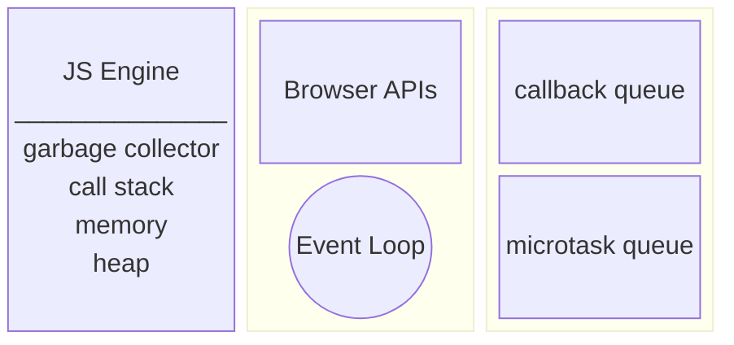

# Looking inside the browser

### Web APIs
A bunch of APIs provided by browser which are accessible insode JS which we can use. These functions can be invoked using window object.
- setTimeout()
- DOM APIs
- fetch()
- local storage
- console
- location(url)

### Event Loop and callback queue

When setTimeout function timer expires, whatever callback is registered to execute is pushed to **callback queue**. 

**Event loop** actively checks fo pending callbacks from callback queue and puts to call stack to start execution.

Callback queue stores all the callback functions and they get chance for execution one by one.

### fetch and microtask queue

Callback function from fetch comes(queues) inside a different queue than callback queue i.e. **microtask queue**. Microtask queue has a higher priority so the task is picked from this first.

Callback function from promises and mutation observer goes inside microtask queue and others in callback queue.