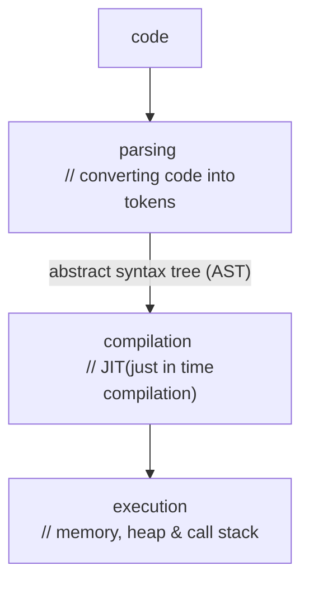

# JavaScript Engine

| **JIT (Just in time compilation)** | **AOT (Ahead of time compilation)** |
| ---------------------------------- | ----------------------------------- |
| AST is passed to interpreter which converts code to bytecode and compiler optimize code on the go for execution phase | AST is provided to compiler and optimize the code before rendering and then finally after compilation phase finishes, code is directly executed |